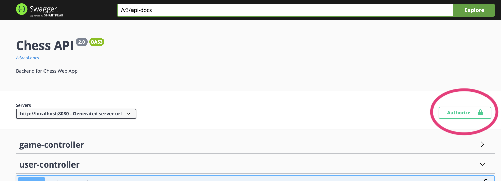

# Chess WebApp

- [Typescript Web Client](#Development-Typescript-Web-Client)
- [Java Backend](#Development-Java-Backend)

## Development - Typescript Web Client

Typescript Client code location `./client`

### Installation

Install [**yarn**](https://yarnpkg.com/getting-started/install)

```
cd ./client && yarn
```

### Run Web Client

```
cd ./client && yarn start
```


## Development - Java Backend

Java API code location: `./app`

### Installation

Install [**Gradle**](https://docs.gradle.org/current/userguide/installation.html)


### Run Application

```
gradle bootRun --args="--spring.profiles.active=development"
```

### API Documentation

Interact with the data (app must be running, and since we use the H2 in-memory database for now, data will reset when app restarts)

[Swagger WEB UI](http://localhost:8080/swagger-ui/index.html?configUrl=/v3/api-docs/swagger-config)

Authenticate by runnng the client app, logging in, and getting a token. Copy the token from the client app and paste into the Swagger UI in the top right corner.



### Access Database

database is stored as ./app/database/developmentDb.mv.db

[H2 Console](http://localhost:8080/h2-console)


### Tests

run tests

```
gradle test
```

Output is minimal if tests succeed. Verbose if they don't. A pretty HTML test report is generated at `./build/reports/index.html`. Open in your browser after running test suite.

Test framework is [JUnit 5 (Jupiter)](https://junit.org/junit5/docs/current/user-guide/#writing-tests)

Add test files in `./app/src/test/java/chess/<path_to_class>/<Class>Test.java`; mirror directory structure of `./app/src/main/java/chess/<path_to_class><Class>.java`


