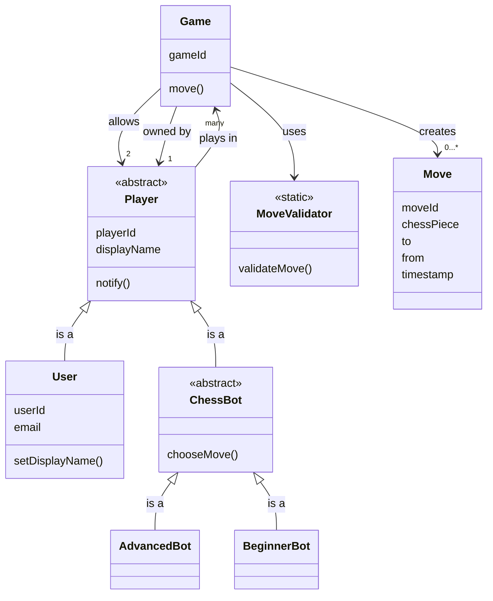

```mermaid
classDiagram


Game --> "2" Player : allows
Game --> "1" Player : owned by
Player --> "many" Game : plays in
Game --> MoveValidator : uses
Game --> "0...*" Move : creates
Player <|-- User : is a
Player <|-- ChessBot : is a
ChessBot <|-- AdvancedBot : is a
ChessBot <|-- BeginnerBot : is a

class Game {
  gameId
  move()
}

class Move {
  moveId
  chessPiece
  to
  from
  timestamp
}

class MoveValidator {
  <<static>>
  validateMove()
}

class Player {
  <<abstract>>
  playerId
  displayName
  notify()
}

class User {
  userId
  email
  setDisplayName()
}

class ChessBot {
  <<abstract>>
  chooseMove()
}

```