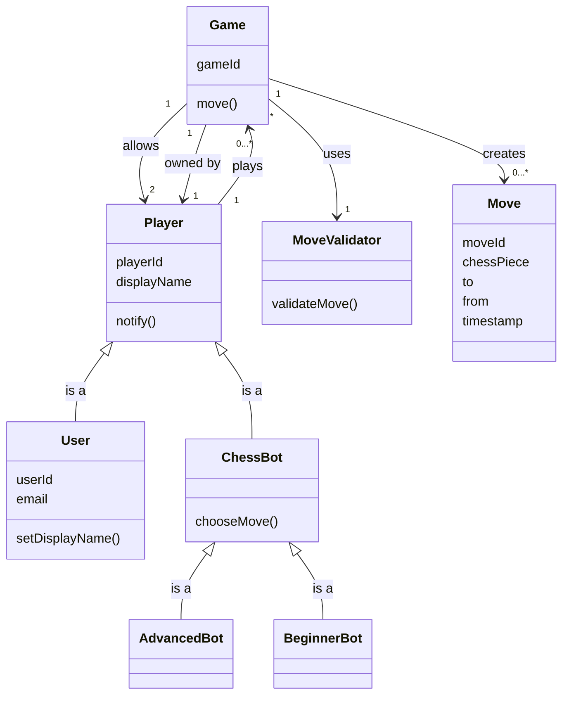

```mermaid
classDiagram

Game "1" --> "2" Player : allows
Game "1" --> "1" Player : owned by
Game "*" --> "1" MoveValidator : uses
Game "1" --> "0...*" Move : creates
Player "1" --> "0...*" Game : plays

Player <|-- User : is a
Player <|-- ChessBot : is a
ChessBot <|-- AdvancedBot : is a
ChessBot <|-- BeginnerBot : is a

class Game {
  gameId
  move()
}

class Move {
  moveId
  chessPiece
  to
  from
  timestamp
}

class MoveValidator {
  validateMove()
}

class Player {
  playerId
  displayName
  notify()
}

class User {
  userId
  email
  setDisplayName()
}

class ChessBot {
  chooseMove()
}

```