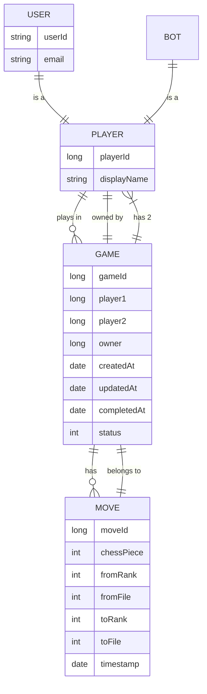

```mermaid
erDiagram

  USER ||--|| PLAYER : "is a"
  BOT ||--|| PLAYER : "is a"
  PLAYER ||--o{ GAME : "plays in"
  GAME ||--|| PLAYER : "owned by"
  GAME ||--|{ PLAYER : "has 2"
  GAME ||--o{ MOVE : has
  MOVE ||--|| GAME : "belongs to"
  

  USER {
    string userId
    string email
  }

  PLAYER {
    long playerId
    string displayName
  }

  GAME {
    long gameId
    long player1
    long player2
    long owner
    date createdAt
    date updatedAt
    date completedAt
    int status
  }

  MOVE {
    long moveId
    int chessPiece
    int fromRank
    int fromFile
    int toRank
    int toFile
    date timestamp
  }

```