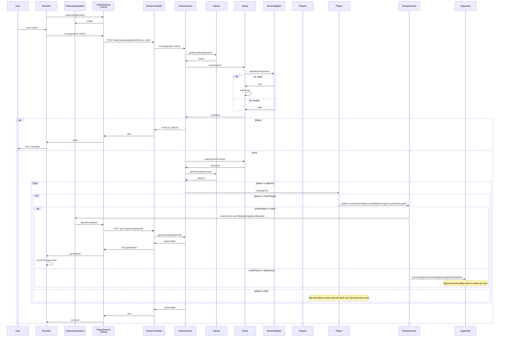

### Making a move from the UI (scroll PDF to page 2, the exporter creates a lot of dead space)

```mermaid
sequenceDiagram

participant User
participant BoardUI
participant GameSubscription
participant ClientGameService as GameService<br>(Client)
participant GameController
participant GameService
participant GameDao as Games
participant Game
participant MoveValidator
participant PlayerDao as Players
participant Player
participant StompService
participant Opponent

BoardUI ->> ClientGameService : subscribe(gameId)
ClientGameService ->> GameSubscription : create
User ->> BoardUI : move piece
BoardUI ->> ClientGameService : move(gameId, intent)
ClientGameService ->> GameController : POST /api/v1/games/{gameId}/move, intent
GameController ->> GameService : move(gameId, intent)
GameService ->> GameDao : getGameById(gameId)
GameDao ->> GameService : Game
GameService ->> Game : move(intent)
Game ->> MoveValidator : validateMove(intent)
alt is valid
  MoveValidator ->> Game : true
  Game ->> Game : add move
else is invalid
  MoveValidator ->> Game : false
end
Game ->> GameService : true|false
alt  false
  GameService ->> GameController : INVALID_MOVE
  GameController ->> ClientGameService : 400
  ClientGameService ->> BoardUI : reject
  BoardUI ->> User : error message
else true
  GameService ->> Game : getPlayersForGame
  Game ->> GameService : playerIds
  GameService ->> GameDao : getPlayers(playerIds)
  GameDao ->> GameService : players
  loop player in players
    GameService ->> Player : notify(game)
    alt player is UserPlayer
      Player ->> StompService : publish /users/{UserPlayer.userId}/games/{game.gameId}/update
      alt UserPlayer is User
        StompService ->> GameSubscription : /users/{User.userId}/games/{gameId}/update
        GameSubscription ->> ClientGameService : gameId updated
        ClientGameService ->> GameController : GET /api/v1/games/{gameId}
        GameController ->> GameService : getGameState(gameId)
        GameService ->> GameController : gameState
        GameController ->> ClientGameService : 200 gameState
        ClientGameService ->> BoardUI : gameState
        BoardUI ->> BoardUI : reconcile view state
      else UserPlayer is Opponent
        StompService ->> Opponent : /users/{Opponent.userId}/games/{gameId}/update
        Note over Opponent : Opponent will update their UI same as User
      end
    else player is Bot
      Note over Player : Bot will make a move and call back into GameService.move
    end
  end
  GameService ->> GameController : gameState
  GameController ->> ClientGameService : 200
  ClientGameService ->> BoardUI : success
end


```